# Conceptual and Logical Database Design

## Entity-Relationship Diagram

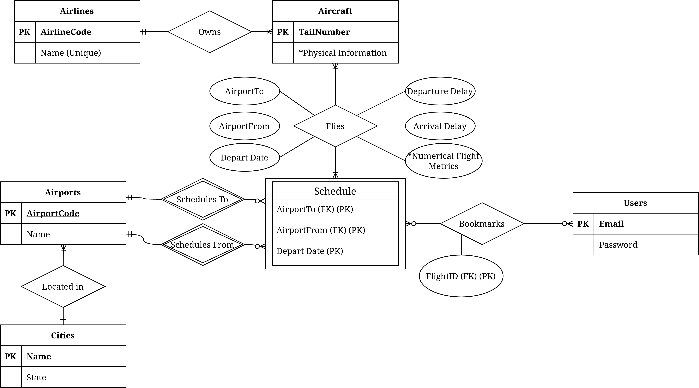

## Assumptions

Each `City` in our database will ***have one or more*** `airports`. Each `Airport` in our database will be in ***exactly one*** `City`. Cities without airports are discarded.

Each `Airline` will have ***at least one*** `Aircraft` but can and will most likely have many. Each `Aircraft` will be owned by ***exactly one*** `Airline`.

Each `Schedule` will have ***exactly one*** AirportTo and one AirportFrom variable; neither can be the same.

Each `User` for our application will be able to save ***multiple*** `Schedules` as their favorite schedules. One `Schedule` can be saved by ***multiple*** `Users`. A `User` may initially **not** have any favorited schedules, and there may be `Schedules` that have **not** been favorited.

Flight numbers may duplicate but all flight numbers on a specific day will be unique.

## Connection to DB

## Database Design language

```sql
    CREATE TABLE Airports (
        ID CHAR(3), 
        Name VARCHAR(77),
        City VARCHAR(45),
        State CHAR(2),
        LATITUDE FLOAT,
        LONGITUDE FLOAT,
        PRIMARY KEY (ID)
    )
```

```sql
    CREATE TABLE Airlines (
        ID CHAR(2), 
        Name VARCHAR(50),
        PRIMARY KEY(ID)
    );
```


```sql
    CREATE TABLE Aircraft (
        N_Number VARCHAR(6), 
        SerialNumber VARCHAR(20), 
        Airline CHAR(2),
        ModelName VARCHAR(255),
        EngineName VARCHAR(255),
        AirworthinessDate DATE,
        PRIMARY KEY (N_Number),
        FOREIGN KEY (Airline) 
            REFERENCES Airlines(ID)
            ON DELETE SET NULL
    );
```

```sql
    CREATE TABLE Flights (
        FlightNumber INT,
        AirportTo CHAR(3),
        AirportFrom CHAR(3),
        DepartureDate DATE,
        AircraftNumber VARCHAR(6),
        DepartureDelay INT,
        ScheduledTime INT,
        ElapsedTime INT,
        AirTime INT,
        ArrivalDelay INT,
        Cancelled BOOLEAN,
        CONSTRAINT PK_Flights PRIMARY KEY (FlightNumber, AirportTo, AirportFrom, DepartureDate, AircraftNumber),
        FOREIGN KEY (AircraftNumber)
            REFERENCES Aircraft(N_Number)
            ON DELETE CASCADE,
        FOREIGN KEY (AirportTo, AirportFrom, DepartureDate) REFERENCES
            Schedules(AirportTo, AirportFrom, DepartureDate)
    );
```

```sql
    CREATE TABLE Schedule (
        AirportTo CHAR(3), 
        AirportFrom CHAR(3), 
        DepartureDate DATE,
        CONSTRAINT PK_Schedule PRIMARY KEY (AirportTo, AirportFrom, DepartureDate),
        FOREIGN KEY (AirportTo) REFERENCES
            Airports(ID),
        FOREIGN KEY (AirportFrom) REFERENCES
            Airports(ID)
    );
```

```sql
    CREATE TABLE Users (
        Email VARCHAR(255), 
        Password VARCHAR(255),
        PRIMARY KEY (Email)
    );
```

```sql
    CREATE TABLE Bookmarks (
        User VARCHAR(255),
        AirportTo CHAR(3), 
        AirportFrom CHAR(3), 
        FlightNumber INT,
        FOREIGN KEY (User) REFERENCES 
            Users(Email),
        FOREIGN KEY (AirportTo) REFERENCES
            Airports(ID),
        FOREIGN KEY (AirportFrom) REFERENCES
            Airports(ID),
        FOREIGN KEY (FlightNumber) REFERENCES
            Flights(FlightNumber),
        CONSTRAINT PK_Bookmarks PRIMARY KEY (User, AirportTo, AirportFrom, FlightNumber)
    );
```

## Implementation

We have used Google Cloud to implement our database, and have successfully done so and managed to connect to the database:

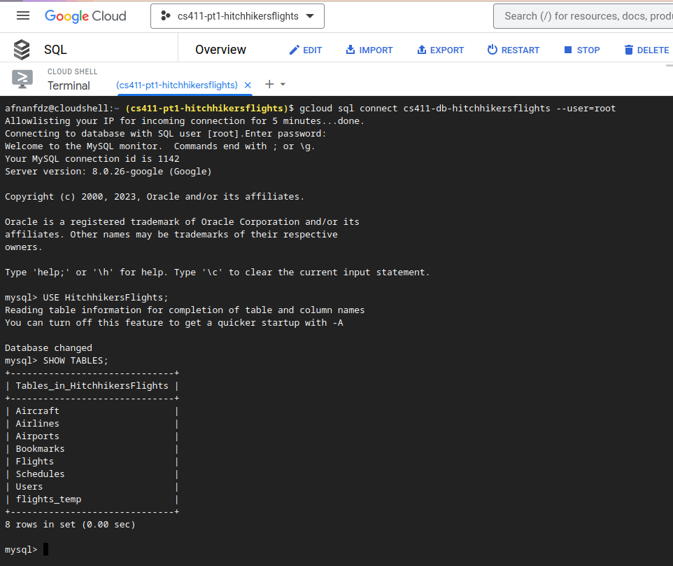

## Advanced Queries

### Query 1: Airlines' Best Flight with Least Delay in a Departure Schedule

Here we are using 'ORD', 'LAX', and Christmas Day as our variables. We are querying for each Airline's best-performing flight (by ArrivalDelay) that flew from Los Angeles International Aiport to O'Hare International Airport, on the 25th of December, 2015.

```sql
SELECT 
    Airline, AircraftNumber, ScheduledTime, DepartureDelay, ElapsedTime, ArrivalDelay 
FROM
    Flights f JOIN Aircraft a ON (a.N_Number = f.AircraftNumber)
WHERE 
    (Airline, ArrivalDelay) IN
    (SELECT 
        Airline, MIN(ArrivalDelay) 
    From 
        Flights f1 JOIN Aircraft a1 ON (a1.N_Number = f1.AircraftNumber)
    WHERE 
        f1.DepartureDate = "2015-12-25" 
        AND f1.AirportTo = "ORD"
        AND f1.AirportFrom = "LAX"
    GROUP BY
        a1.Airline    
    ) 
    AND DepartureDate = '2015-12-25' AND AirportTo = 'ORD' AND AirportFrom = 'LAX'
ORDER BY 
    ArrivalDelay ASC;
```

This is the resulting output, which has less than 15 rows (not many airlines schedule one airport in a day):

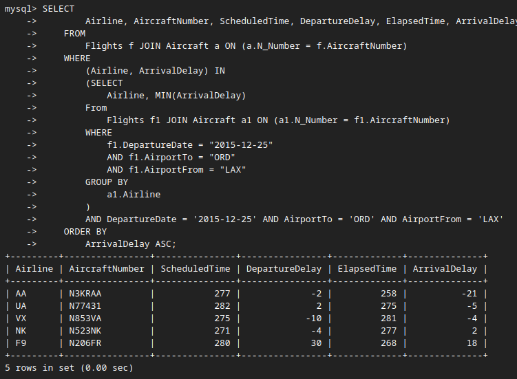

### Query 2: Aircraft's Best Flights In A Departure Schedule

We are asking: For a given Aircraft (by N-Number / ID), in which departure schedules did they perform best (had the least ArrivalDelay of all flights)? We use Aircraft `N288WN` for this query.

```sql
SELECT 
    f.DepartureDate, f.AirportFrom, f.AirportTo, f.DepartureDelay, f.ElapsedTime, f.ArrivalDelay, f.AircraftNumber 
FROM 
    Flights f 
    INNER JOIN (
        SELECT DISTINCT
                DepartureDate, AirportFrom, AirportTo
            FROM
                Flights
            WHERE
                AircraftNumber = 'N288WN'
        ) target
    ON 
        f.DepartureDate = target.DepartureDate AND
        f.AirportFrom = target.AirportFrom AND
        f.AirportTo = target.AirportTo
GROUP BY
    f.DepartureDate, f.
WHERE 
    AircraftNumber = 'N288WN'
ORDER BY 
    ArrivalDelay
LIMIT 15;
```

The following is the result for the above aircraft, which had several hundred rows, so we limited it to 15:

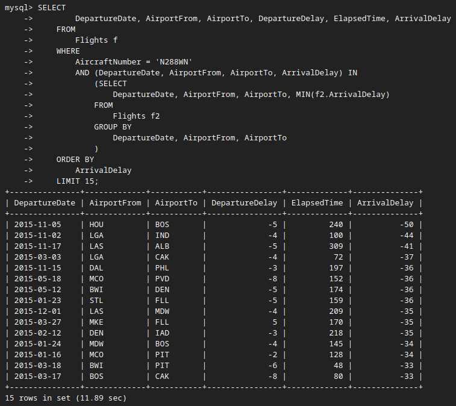

## Indexing

### Query 1

#### Original, Unindexed

Without any indexing, our query has a cost of `14.70`.

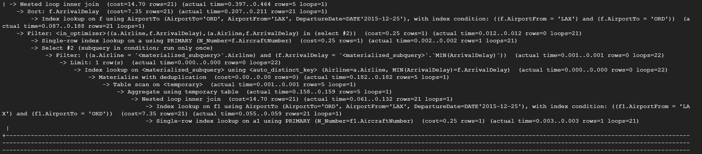

#### Index Design 1

Using the indexing:

```sql
Create Index destairport on Flights(AirportTo);
Create Index depairport on Flights(AirportFrom);
```

We do not see a change in the cost; it remains as `14.70`.

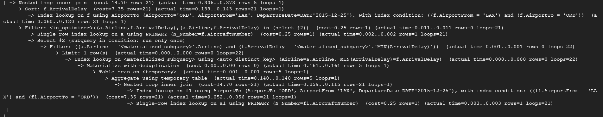

We believe the performance to be unchanged because we are indexing on what are already primary keys, which we assume are as optimal as can be. We proceed anyways:

#### Index Design 2

We add on these indexes:

```sql
Create Index aline on Aircraft(Airline);
Create Index adelay on Flights(ArrivalDelay);
```

The cost remains unchanged at `14.70`.

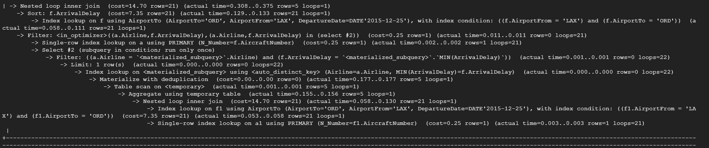

#### Index Design 3

```sql
Create Index nnumbers on Aircraft(N_Numbers);
Create Index anumber on Flights(AircraftNumber);
```

Once again, the cost remains unchanged at `14.70`.

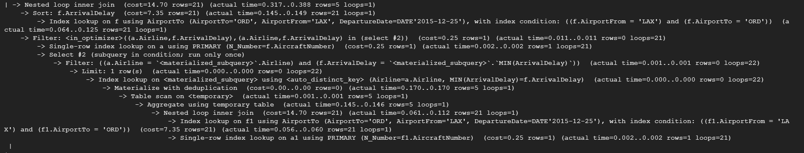

#### Query 1 Indexing Discussion

Overall, indexing **did not change the cost of Query 1**. We believe this to be the case because we are performing JOINs on primary keys, and our WHERE operation is also exclusively on primary keys. Therefore our query is likely as optimized as can be, and indexing does not further influence it.

### Query 2

We expect indexing to have some influence here as the query is relatively more complex and operates on some columns that are not primary keys. Here are our findings:

#### Original, Unindexed

This query has a cost of `929.98` rows. It took significantly longer to obtain this query, so we are more interested and focused on optimizing for this one.

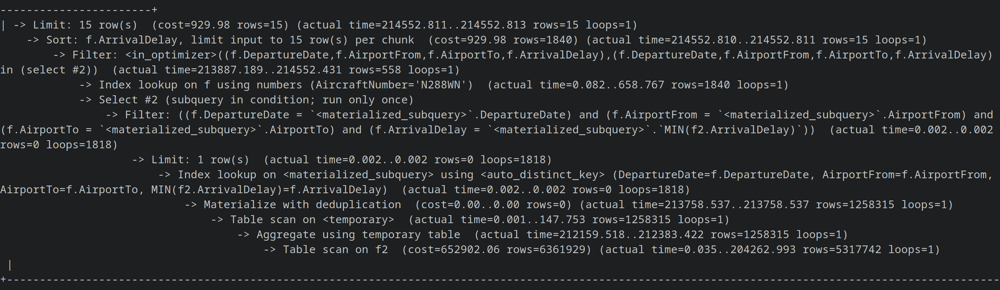

#### Index Design 1

We begin with the indexing with most potential. That is, we index on `ArrivalDelay` which we operate on a lot on this query.

```sql
CREATE INDEX fdelay on Flights(ArrivalDelay);
```

This has lowered the cost to `644.00`. 

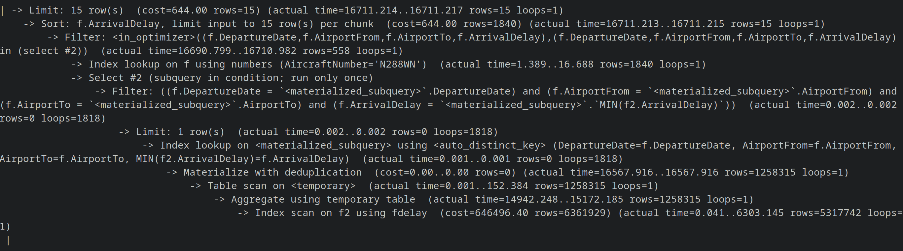

#### Index Design 2

Adding onto the previous indexing, we do:

```sql
CREATE INDEX fdeptdelay on Flights(DepartureDelay);
```

The cost is unchanged, remaning at `644.00`.

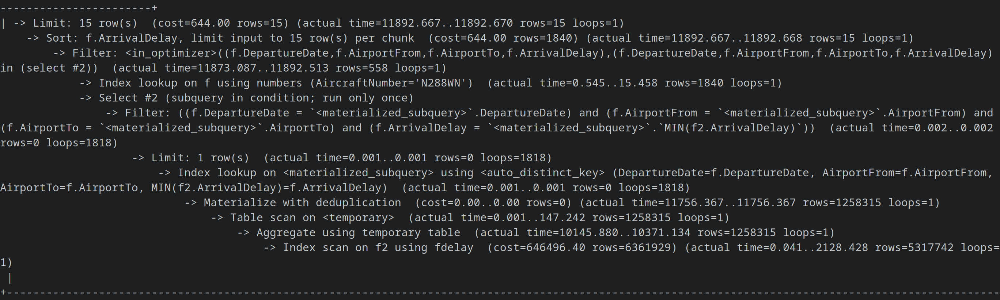

We assume this to be because `DepartureDelay` s a column we select from, but do not perform JOIN or WHERE operations on, so it does not add any complexity to the query.

#### Index Design 3

Finally, noticing that `AircraftNumber` is a foreign key but not a primary key here, we try:

```sql
CREATE INDEX faircraft on Flights(AircraftNumber);
```

We note that this returned 1 warning. Attempting the query failed to return anything, so we try something else:

```sql
CREATE INDEX felapsed on Flights(ElapsedTime);
```

This, again, failed to make a change in cost, which remains at `644`.

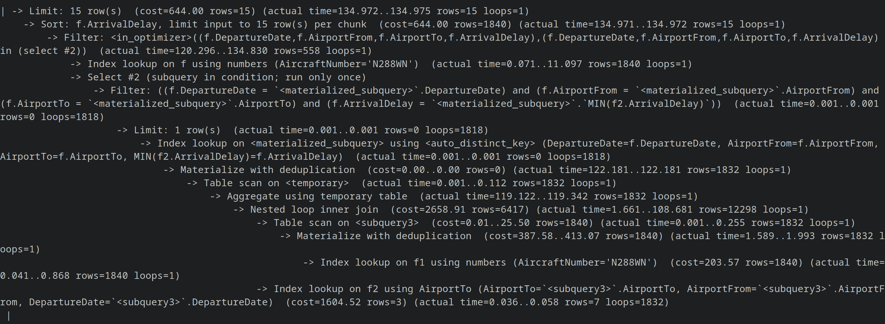

#### Query 2 Indexing Discussion

Designing indexes for this query was somewhat more productive as there was one indexing that resulted in a reduced query time, which was indexing on `ArrivalDelay` which we filter on. The rest that we tried had no influence, arguably because those are values we return but do not query on. We also argue that this is not a big problem, as the reason why we cannot reduce time further is, similar to Query 1, we are filtering on primary and secondary keys maximally.

## Relational Schema

We have lifted many-to-many relationships into their own tables:

```sql
    Cities (
        Name:VARCHAR(45) [PK], 
        State:VARCHAR(30)
    )
```

```sql
    Airports (
        ID: CHAR(3) [PK], 
        Name:VARCHAR(77),
        City:VARCHAR(45) [FK to Cities.Name]
    )
```

```sql
    Airlines (
        ID: CHAR(2) [PK], 
        Name: VARCHAR(50)
    )
```

```sql
    Aircraft (
        ID: CHAR(5) [PK], 
        Model: INT [FK to AircraftModels.ID], 
        Engine: INT [FK to Engines.ID]
    )
```

```sql
    Flights (
        FlightNumber: INT [PK], 
        AirportTo: CHAR(3) [PK] [FK to Schedules.AirportTo]
        AirportFrom: CHAR(3) [PK] [FK to Schedules.AirportFrom]
        DepartureDate: DATE [PK] [FK to Schedules.DepartureDate], 
        AircraftNumber: VARCHAR(6) [FK to Aircraft.ID], 
        DepartureDelay: INT,
        ScheduledTime: INT,
        ElapsedTime: INT,
        AirTime: INT,
        ArrivalDelay: INT,
        Canceled: BOOLEAN
    )
```

```sql
    Schedule (
        AirportTo: CHAR(3) [FK to Airports.ID], 
        AirportFrom: CHAR(3) [FK to Airports.ID], 
        DepartureDate: DATE
    )
```

```sql
    Users (
        Email: VARCHAR(255) [PK], 
        Password: VARCHAR(255)
    )
```

```sql
    Bookmarks (
        User: VARCHAR(255) [PK] [FK to Users.Email]
        AirportTo: CHAR(3) [PK] [FK to Airports.ID], 
        AirportFrom: CHAR(3) [PK] [FK to Airports.ID], 
        FlightNumber: INT [PK] [FK to Flights.FlightNumber]
    )
```