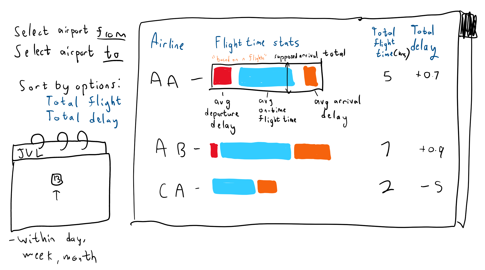

# Hitchhiker's Guide to Airline Delays

## STAGE 2 UPDATE: Additional Information

### CRUD Operations

Beyond basic storing of user information and passwords, users are also allowed to **save favorite flights** from the results they lookup using our app. We hope to be able to implement presenting summary statistics will be provided over all the flights they save.

### Statistics Calculations

Internally, we will use the R programming language to create graphs for our data. This will likely be interfaced using a Python library, where we use Python to handle the backend.

### 3 Tables, 1000 Rows Each

We now have more data, combining aircraft data from [the FAA Aircraft Registry Database](https://www.faa.gov/licenses_certificates/aircraft_certification/aircraft_registry/releasable_aircraft_download) and city data from the [the World Cities Dataset](https://www.kaggle.com/datasets/juanmah/world-cities).

We believe these three tables can satisfy the requirements:

- Aircraft Ownership Relationship Table: One airline owns many aircrafts. There are over 4000 unique tail numbers in the `flights.csv` dataset.
- 'Flies' relationship table. An aircraft handles many flights over many dates. Given how many aircraft there are, and how many flights occur, we believe this to be over 3000 rows.
- 'Schedules' table. On a given date, there are many schedules for going from one airport to another. Over a whole year, we believe strongly that there would be over 3000 schedules.

## Data Stored

Our data would be extracted from the [2015 Flight Delays and Cancellations](https://www.kaggle.com/datasets/usdot/flight-delays?select=flights.csv) database.

From `airlines.csv`:

We utilize `IATA_CODE` and `AIRLINE`, as our app will present statistics airline by airline, and will use these to identify them.

From `airports.csv`:

We utilize `IATA_CODE` (of airports), `AIRPORT`, and possibly `CITY`. We use these as our app is based on choosing flights from one airport to another.

From `flights.csv`:

The primary metrics we wish to calculate are **total flight time**, **'supposed' total flight time** based on scheduled departure and arrival, **total delay**, **amount of departure delay**, and **amount of arrival delay**. To this end we would utilize the `AIR_TIME`, `SCHEDULED_ARRIVAL`, `SCHEDULD_DEPARTURE`, `ARRIVAL_DELAY`, `DEPARTURE_DELAY`, `DEPARTURE_TIME`, `ARRIVAL_TIME`, and possibly other related values. We may also look at analyzing `CANCELLED` flights. 

We will use `ORIGIN_AIRPORT` and `DESTINATION_AIRPORT` as information for user selection filtering.

We will also use `YEAR`, `MONTH`, and possibly `DAY` to narrow down the flights we would analyze for requests in this app.

## Basic Functions

### Inputs

- Departure airport
- Destination airport
- Date of departure

### Outputs

- A list of airlines that fly the input route, their average total flight time, and their average measures of delay (or lack thereof). This list can be sorted by ascending/descending total time, or ascending/descending total delay.

## Creative Component

We will be using plotted graphs to present the above output (see mockup).

## Project Summary

You would like to get from A to B in the United States by domestic flight, and would like to do so without risk of too much delay nor cancellation. Our app serves to present statistical data to users on how airlines perform for flying from one airport to another, around the date chosen by the user!

### Description

Our goal is to allow the users to find the optimal flight for their time and flight when factoring in the delay time and chance of cancellation.

Our application will take data of flight delays and cancellations and will utilize this data to give estimates for delay %, average delay time, and % canceled for flights for each airline. We will average this data over a week time span, or on an individual day basis for popular days like Holidays. We will show this data via multiple visualizations that show delay time vs expected time.

The overall goal is to allow the user to avoid a delay or cancellation based on airline choice, and we will be using delay times for each Airline as a way to compare. 

### Usefulness

This application will be useful for helping people decide which flight option is the least risky as well as seeing the total delay times. It can be used by both casual travelers and business travelers. It can let them make a decision that has the least amount of risk as often when flying, being delayed by even a couple hours can mess up a corporate meeting, hotel check-in, or a later connecting flight. Thus, this can help you see historically what days and what flight plans have the greatest chance of success arriving on time. It will be especially useful for the busier times like holidays and during winter as you can see which months usually have more delays and cancellations and on busy days, what airports get more delayed.

The project is most similar to Google Maps or online travel sites like Expedia as it shows airline flight times and destinations. However where it differs is that we show trends based on delays in the past and provide a prediction number for how likely a specific flight is to get delayed which Google Maps and Expedia usually don’t account for.

### Realness

Our data is sourced from the Transportation Department’s 2015 Flight Delays and Cancellations Data Set. We know this data will be valid as it is from a Government Department and we are confident this data will accurately depict delays. However our one issue with the realness and reliability of the data is that it is from 2015 which means there have been some changes since then, however it is the most reliable due to the source and the fact that since the Covid pandemic affected airline numbers during and after the pandemic, 2015 is more similar to current airline activity. 

The data itself includes airport data, time for delays, amount of cancellations, time in air, and many smaller times incorporated in total time, such as time between gate departure and wheels off. This data is all sourced reliably and will be used in our calculations for avoiding delay and cancellations.

## Functionality

Users will be able to input their time of arrival, and destination and departure airport, with a potential functionality of inputting a city for multi-airport cities. 

The app presents a list of bars for each airline that fly this route at the given time. The bar represents total flight time, and is separated into several categories: average departure delay ie delay at airport, average 'expected' or normal flight time, and average delay from arrival. These estimates inform our users of the most likely spot they will be stuck in if their flight is delayed. 

### Mockup

### Work Distribution

Front-end development is led by Ziyue, Ansh and Connor. Back-end development is mostly led by Afnan and backend choice depends on maximum ease of plotting visual graphs. Database-related work is split equally.
